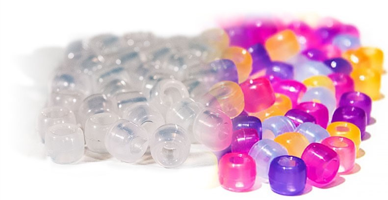

# Ultraviolet (UV) beads, Extended Lesson
This activity covers concepts such as the elctromagnetic spectrum and how light interacts with matter. Additionally, it discusses how UV beads work and guides experiments around that concept.
  

### Goal: To demonstrate how different nanoscale properties can impact a macroscale properties (such as color).
### Background knowledge required:
1. The model of an atom
2. Bonding
3. How to draw the structure of a molecule
4. Simple algebra

### For teachers and administrators:
Lesson plans are in the `Lesson Plans` folder. The notebook is dividing into two activities:
1. UV Beads (requires physical supplies)
2. Nanoparticle Color (can be done using the Jupyter notebook exclusively)

While the Nanoparticle Color lesson (the focus of the Jupyter Notebook) builds off of concepts in the UV Beads lesson, it can be done independently.

### For students:
To run the activity in your browser, open up the Jupyter notebook using Google Collab via Binder...

# Acknowledgements
This lesson is proudly sponsored by the University of Washington Molecular Engineering Materials Center (UW MEM-C).
  

